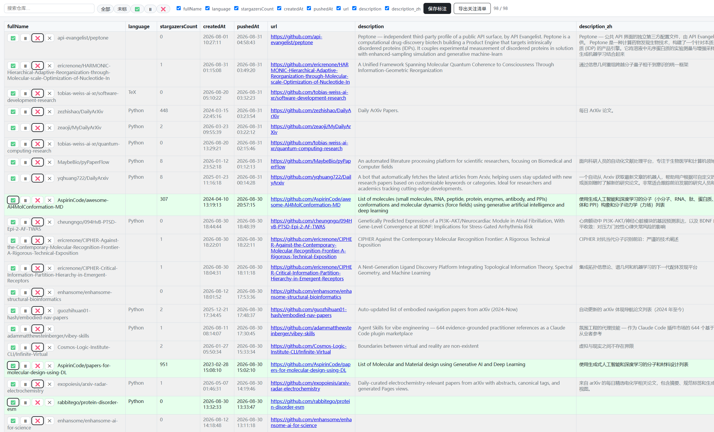

# 后处理规划：GitHub Actions 产物的消化流程

> 两条自动化管线（daily / weekly）负责**采集**，本规划描述它们产出的数据如何被**消化**——
> 从「看一眼」到「沉淀进自己的知识库」。目标一致：**筛选出值得关注的仓库 → star → 学习 → 把有价值的内容提炼进我们的 skill**。
>
> 英文版见文末 / English version at the bottom of this file.

## 0. 总体思路

```
GitHub Actions 采集
   ├─ daily（每日 05:00 北京） → monitor/ 日志（txt）
   └─ weekly（周一 08:00 北京）→ discovery/ 周报（csv）

消化路径（两条管线共用同一套动作）：
   发现/筛选 → 判断是否关注 → star（GitHub 关注）→ 学习（阅读/试用）
              → 提炼有价值内容 → 补充进 template/ontology skill（LHT）
                                  → 理论知识 → 快速碎片化记录到博客
```

三个核心动作：

- **star**：在 GitHub 上给感兴趣的仓库点星，形成我们自己的 star 集合；
- **skill 补充**：把值得沉淀的东西（新工具、新方法、数据集、论文、可复用模板）提炼后，补进我们的 template/ontology skill（LHT）；
- **博客碎片化输出**：把学习过程中积累的理论知识快速记录成碎片化笔记，输出到博客网站；不追求成体系，重在**即时记录、日后再整理**，实现快速碎片化学习。

---

## 1. 输入产物（Actions 生成了什么）

### daily-follow（每天 05:00 北京）

触发：外部 Cron-job.org → `workflow_dispatch`。产物是纯文本活动日志，按日期分文件：

| 文件 | 内容 | 数据源 |
|---|---|---|
| `monitor/users/YYYY/MM/DD.txt` | 关注用户当天的动态 | `monitor/lists/users.txt` |
| `monitor/orgs/YYYY/MM/DD.txt` | 关注组织/实验室的动态 | `monitor/lists/orgs.txt` |
| `monitor/received/YYYY/MM/DD.txt` | 核心用户最近关注的信息流 | `monitor/lists/users_core.txt`（`-r`，limit 30） |

### weekly-discovery（周一 08:00 北京）

触发：外部 Cron-job.org → `workflow_dispatch`。三个 topic 合跑、单个 topic 失败不影响其他。产物是周报 CSV：

```
discovery/weekly/YYYY/MM/<topic>_YYYY-MM-DD.csv   # topic ∈ idr / protein_struct_ai / protein_dna
```

列：`fullName, language, stargazersCount, createdAt, pushedAt, url, description, description_zh`（review 后追加 `mark` 列）。

---

## 2. daily 后处理流程（每天 / 或攒几天集中看）

1. **查看**当天日志：`monitor/users|orgs|received/YYYY/MM/DD.txt`
   - 也可用现有脚本做统计分析：`python3 scripts/analyze_logs.py monitor/users/*/*/*/*.txt`
2. **筛选**：从日志中找出感兴趣的仓库（新发布、高 star、多人推荐、与你的方向相关）
3. **star**：在 GitHub 上给这些仓库点星，收进 star 集合
4. **学习**：打开仓库读 README / 关键代码 / 论文，判断是否值得深入了解，需要时 clone 下来试用
5. **提炼**：把有用的东西（方法、工具、数据、可复用片段）补充进 template/ontology skill（LHT）

> daily 日志只做「人工阅览 + 筛选 + star」，不落盘任何标记；信息密度低、噪音大，适合快速扫。

---

## 3. weekly 后处理流程（每周一 Actions 跑完后的固定动作）

核心：用 `scripts/csv_review.py` 在浏览器里逐条批注周报，批注结果写回 CSV 并 push。

1. **拉取**：`git pull` 拿到最新的周报 CSV（`discovery/weekly/YYYY/MM/<topic>_YYYY-MM-DD.csv`）
2. **打开**：
   ```bash
   python3 scripts/csv_review.py discovery/weekly/YYYY/MM/<topic>_YYYY-MM-DD.csv
   ```
   可选 `--port 8000` / `--no-browser`；会自动打开浏览器页面。
3. **批注**（在 JS 界面逐行判断，长简介已自动换行，无需横向滚动）：
   - ✅ 关注（值得保留/跟进）→ 行变绿
   - ⏸ 稍后（拿不准，之后再回看）→ 行变黄
   - ❌ 跳过（不相关）→ 行变灰
   - ✕ 清除标记
   - 顶部可用搜索框 / 标记筛选（全部·未标·✅·⏸·❌）/ 列显隐 / 排序来加速
4. **保存**：点「保存标注」，标记写回 CSV 的 `mark` 列（存 ✅/⏸/❌，直接打开 CSV 也醒目）
5. **导出（可选）**：点「导出关注清单」，把 ✅ 行（`fullName + url + 中文简介`）复制到剪贴板，作为后续 star / 整理清单
6. **提交推送**：
   ```bash
   git add discovery/weekly/YYYY/MM/
   git commit -m "review <topic> <YYYY-MM-DD>"
   git push
   ```
   带 `mark` 列的 CSV 随仓库走，标记在团队内可见、也可跨会话恢复。
7. **对 ✅ 的仓库执行与 daily 相同的动作**：star → 学习 → 提炼 → 补充进 template/ontology skill（LHT）
8. **博客碎片化学习（可选但推荐）**：学习过程中遇到值得记的理论知识（方法原理、概念、trick），快速写成碎片化笔记发到博客；不追求成体系，重在**即时记录**，日后再整理。

> 与 daily 的区别：weekly 有**落盘标记**（`mark` 列）和**导出清单**，因为 CSV 结构化、适合逐条审阅沉淀；daily 只是人工筛选 + star。




---

## 4. 两条管线对比

| | daily-follow | weekly-discovery |
|---|---|---|
| 频率 | 每天 05:00 | 每周一 08:00 |
| 产物 | `monitor/*/YYYY/MM/DD.txt` 文本日志 | `discovery/weekly/YYYY/MM/<topic>_*.csv` 结构化周报 |
| 查看方式 | 直接读 txt / `analyze_logs.py` 统计 | `csv_review.py` 浏览器界面 |
| 是否落盘标记 | 否 | 是（`mark` 列，✅/⏸/❌） |
| 导出清单 | 无 | 有（导出关注清单 = ✅ 行） |
| 后续动作 | star → 学习 → 补充 skill | 批注→push → 对 ✅ star → 学习 → 补充 skill |
| 噪音/信息密度 | 高、碎片化，快速扫 | 低、结构化，逐条沉淀 |

---

## 5. 注意事项与边界

- **标记存本地 CSV，需自己 push**：csv_review 的「保存标注」只写本地文件，不会自动同步 GitHub；要随仓库走必须手动 `git commit + push`。
- **每周新文件从零标**：文件名带日期，下周是全新文件，与上周已标的文件互不影响。
- **不要在同文件上重跑 weekly_report.py**：它会把整个 CSV 重写，`mark` 列会被覆盖掉；正常流程下每周新文件名不同，不会触发这种情况。
- **「补充进 skill」的具体形式**由 skill 自身约定（模板/本体条目的维护方式），本规划只约定动作与时机。
- **博客输出是「碎片化」的**：不用等学完整理成文，边看边记一两段即可；skill 偏结构化沉淀，博客偏即时记录与分享，两者互补。
- 三条 daily 子列表（users / orgs / received）建议分别扫，`received` 是核心用户的关注流，信号更集中。

## 6. 相关文件速查

| 路径 | 作用 |
|---|---|
| `.github/workflows/daily.yml` | daily 采集 |
| `.github/workflows/weekly.yml` | weekly 采集（3 topic 合跑） |
| `scripts/csv_review.py` | 周报批注工具（本规划的核心工具） |
| `scripts/weekly_report.py` | 生成周报 CSV（含中文翻译列） |
| `scripts/analyze_logs.py` | daily 日志统计分析 |
| `monitor/lists/*.txt` | 关注列表（users / orgs / users_core） |
| `discovery/queries/*.yaml` | 三个 topic 的搜索配置 |

---
---

# Post-Processing Plan: Digesting GitHub Actions Outputs

> The two automated pipelines (daily / weekly) do the *collecting*; this plan describes how their output is *digested* — from "a quick look" to "distilled into our own knowledge base". The goal is the same for both: **screen for interesting repos → star them → study them → extract the valuable parts into our skill**.
>
> 中文版见文首 / Chinese version at the top of this file.

## 0. Overall Idea

```
GitHub Actions collects
   ├─ daily (daily 05:00 Beijing)  → monitor/ logs (txt)
   └─ weekly (weekly Mon 08:00 Beijing) → discovery/ reports (csv)

Digest path (the same set of actions for both pipelines):
   discover/screen → judge → star (GitHub) → study (read/try)
              → extract the valuable parts → feed into our template/ontology skill (LHT)
                                  → theoretical knowledge → capture in quick fragmented blog notes
```

Three core actions:

- **Star**: star the interesting repos on GitHub to build up our own star collection.
- **Feed the skill**: distill the worthwhile content (new tools, methods, datasets, papers, reusable templates) into our template/ontology skill (LHT).
- **Blog in small bites**: jot down theoretical knowledge picked up while studying (principles, concepts, tricks) into short fragmented blog notes. Don't aim for a polished article — the point is to *capture immediately, organize later*, i.e. fast fragmented learning.

---

## 1. Pipeline Outputs (What Actions Produces)

### daily-follow (every day 05:00 Beijing)

Trigger: external Cron-job.org → `workflow_dispatch`. Plain-text activity logs, one file per day:

| File | Content | Source |
|---|---|---|
| `monitor/users/YYYY/MM/DD.txt` | followed users' daily activity | `monitor/lists/users.txt` |
| `monitor/orgs/YYYY/MM/DD.txt` | followed orgs & labs' activity | `monitor/lists/orgs.txt` |
| `monitor/received/YYYY/MM/DD.txt` | feed of what core users watch | `monitor/lists/users_core.txt` (`-r`, limit 30) |

### weekly-discovery (Monday 08:00 Beijing)

Trigger: external Cron-job.org → `workflow_dispatch`. All three topics run together; a failure in one topic does not interrupt the others. The output is the weekly report CSV:

```
discovery/weekly/YYYY/MM/<topic>_YYYY-MM-DD.csv   # topic ∈ idr / protein_struct_ai / protein_dna
```

Columns: `fullName, language, stargazersCount, createdAt, pushedAt, url, description, description_zh` (a `mark` column is appended after review).

---

## 2. daily Post-Processing (daily, or batched every few days)

1. **Read** the day's logs: `monitor/users|orgs|received/YYYY/MM/DD.txt`
   - Or summarize them with the analysis script: `python3 scripts/analyze_logs.py monitor/users/*/*/*/*.txt`
2. **Screen**: pick out interesting repos — newly released, high-star, recommended by several people, or related to your direction.
3. **Star**: star them on GitHub to add to your star collection.
4. **Study**: open the repo, read the README / key code / paper, decide whether it is worth a deeper look; clone and try it when it is.
5. **Distill**: feed the useful bits (methods, tools, data, reusable snippets) into the template/ontology skill (LHT).

> Daily logs are only for manual reading + screening + starring — no marks are persisted; they are low-density and noisy, so skim fast.

---

## 3. weekly Post-Processing (the standing routine after each Monday run)

Core: use `scripts/csv_review.py` to annotate the weekly report repo-by-repo in the browser, write the marks back into the CSV, and push.

1. **Pull**: `git pull` to fetch the newest weekly CSVs (`discovery/weekly/YYYY/MM/<topic>_YYYY-MM-DD.csv`).
2. **Open**:
   ```bash
   python3 scripts/csv_review.py discovery/weekly/YYYY/MM/<topic>_YYYY-MM-DD.csv
   ```
   Optional: `--port 8000`, `--no-browser`; the browser auto-opens.
3. **Annotate** (judge row by row; long cells wrap, no horizontal scrolling):
   - ✅ keep (worth keeping & following up) → row turns green
   - ⏸ later (undecided, revisit later) → row turns yellow
   - ❌ skip (irrelevant) → row turns grey
   - ✕ clear the mark
   - Top toolbar: search box / mark filter (all·unmarked·✅·⏸·❌) / column toggles / sorting.
4. **Save**: click "保存标注 / Save marks" — marks are written to the CSV's `mark` column (stored as ✅/⏸/❌, also eye-catching when the CSV is opened by hand).
5. **Export (optional)**: click "导出关注清单 / Export keep-list" — copies the ✅ rows (`fullName + url + description_zh`) to the clipboard as a to-do list for starring / organizing.
6. **Commit & push**:
   ```bash
   git add discovery/weekly/YYYY/MM/
   git commit -m "review <topic> <YYYY-MM-DD>"
   git push
   ```
   The CSV with its `mark` column travels with the repo — marks are visible to the team and survive across sessions.
7. **For the ✅ repos, do the same as daily**: star → study → distill → feed into the template/ontology skill (LHT).
8. **Fragmented blog learning (optional but recommended)**: when studying, jot down noteworthy theoretical knowledge (method principles, concepts, tricks) into short blog notes. Don't wait for a finished article — the point is to *capture immediately*, organize later.

> vs. daily: weekly has *persisted marks* (the `mark` column) and an *export list*, because the CSV is structured and suited to per-row review; daily is only manual screening + starring.

---

## 4. Pipeline Comparison

| | daily-follow | weekly-discovery |
|---|---|---|
| Frequency | daily 05:00 | weekly Mon 08:00 |
| Output | `monitor/*/YYYY/MM/DD.txt` text logs | `discovery/weekly/YYYY/MM/<topic>_*.csv` structured CSVs |
| Viewing | read txt / `analyze_logs.py` stats | `csv_review.py` browser UI |
| Persisted marks | no | yes (`mark` column, ✅/⏸/❌) |
| Export | none | yes (keep-list = ✅ rows) |
| Follow-up | star → study → feed skill | annotate→push → star ✅ → study → feed skill |
| Noise & density | high, fragmented, skim | low, structured, per-row |

---

## 5. Notes & Boundaries

- **Marks live in the local CSV — push manually**: "Save marks" only writes the local file; it does not auto-sync to GitHub. To share the marks, commit and push yourself.
- **Each week's file starts unmarked**: filenames are dated, so next week's file is brand new and untouched by last week's marks.
- **Don't re-run weekly_report.py on the same file**: it regenerates the whole CSV and would wipe the `mark` column; in the normal flow each week's file has a new name, so this never bites.
- **The exact "feed into the skill" mechanics**: follow the skill's own conventions for maintaining its template/ontology entries; this plan only sets the actions and timing.
- **Blog output is "fragmented" by design**: no need to finish studying before writing; capture a paragraph or two as you go. The skill is for structured distillation; the blog is for immediate capture and sharing — the two complement each other.
- Skim the three daily sub-lists separately; `received` is the core users' feed and is the most signal-dense.

## 6. File Reference

| Path | Purpose |
|---|---|
| `.github/workflows/daily.yml` | daily collection |
| `.github/workflows/weekly.yml` | weekly collection (3 topics in one run) |
| `scripts/csv_review.py` | weekly-CSV review tool (the core tool here) |
| `scripts/weekly_report.py` | generates weekly CSVs (with Chinese translation column) |
| `scripts/analyze_logs.py` | daily-log statistics |
| `monitor/lists/*.txt` | watchlists (users / orgs / users_core) |
| `discovery/queries/*.yaml` | search config for the three topics |
